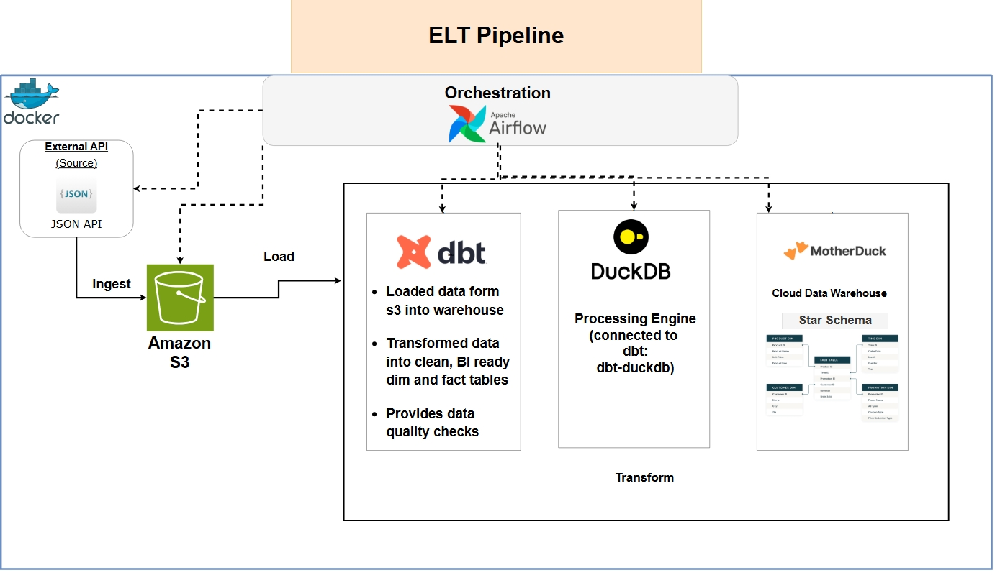
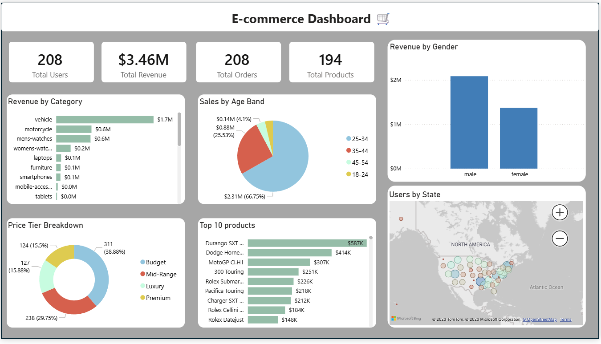
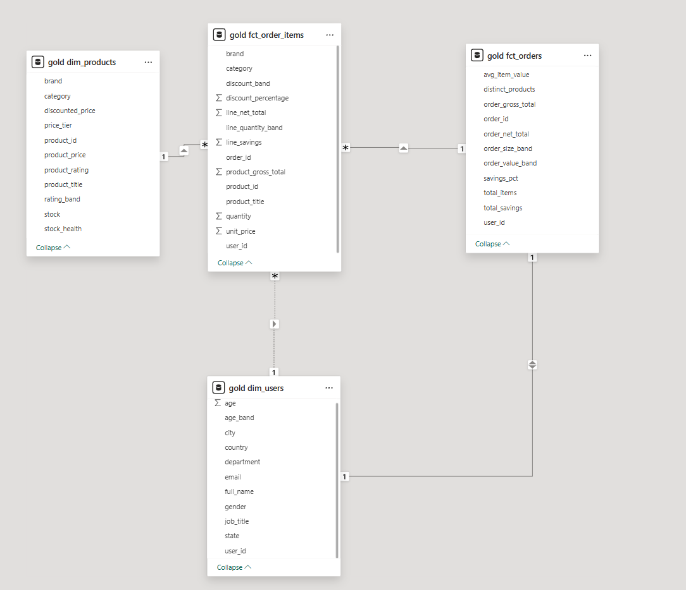
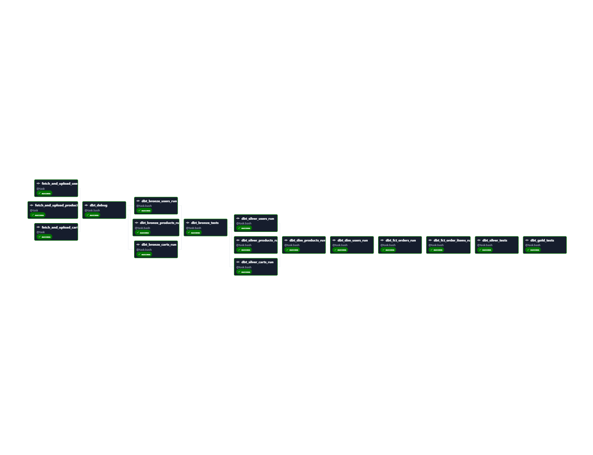

#  🛒 Modern_E-commerce_Lakehouse

## 📌 Overview

With the rise of cloud providers like Azure, AWS, and Google Cloud, many companies and enterprises have adopted this new modern architecture called 
a data lakehouse. 

The goal of a data lakehouse is to provide a reliable, scalable, cost-efficient, single unified source of truth. It combines the low cost cloud object storage
like (like S3 or ADLS) with the high-performance management and governance of a data warehouse in order to achive its goal. 

It is designed to eliminate the need for maintaining two separate, 
siloed systems, allowing you to run both business intelligence (BI) and machine learning (ML) on a single platform. 

Lakehouses are great for e-commerce because they can be used to analyze real-time and historical data in order to optimize supply chains and inventory management, but can also support advanced machine learning for 
recommendation engines and predictive demand forecasting.

For this project, real-time analysis was the main focus as the data provided information about items shoppers were currently buying. 

## 🎯 Objectives
- Build a free and scalable ELT pipeline on local machine
- Automate and Orchestrate pipeline using Airflow
- Provide quality checks throughout transfomations and stages
- Design a star schema data warehouse ready for BI
- Generate business insights through SQL and dashboards

---

## 🏗️ Architecture
<div align="center">

</div>

Used Apache Airflow to orchestrate pipeline end-to-end without the need to manually trigger every step. 
1. **Extract/Ingest:** A Python script is read that extracts data from API as a Json file and converts it into Parquet. It then loads Parquet file into our object storage service (S3).
2. **Load:** Using DuckDB and dbt as dbt-Duckdb, the raw data from S3 was loaded into our cloud warhouse, MotherDuck.
3. **Transform** Dbt-Duckdb allowed us to use the medallion architecture in order to ensure clean and consistent data ready to be used for BI or AI. Dbt provided data quality checks trhoughout each step aswell. 

---

## 🛠️ Important Links & Tools:
- [REST API](https://dummyjson.com/) : Fake REST API used to obtain data (users, products, carts)
- [Docker](https://docs.docker.com/get-started/get-docker/) : Platform used to build, deploy, run, and manage pipeline in standardized units called containers
- [Apache Airflow](https://airflow.apache.org/docs/apache-airflow/stable/howto/docker-compose/index.html) : Orchestration tool used to automatically run pipeline end-to-end
- [Amazon S3](https://aws.amazon.com/s3/) : Object storage service used for storing Parquet files of our API data
- [Data Build Tool (dbt)](https://www.getdbt.com/) : Open-source software used to transfrom data already in data warehouse via SQL statements
- [DuckDB](https://duckdb.org/) : Open-source SQL OLAP database management system designed for fast, analytical queries
- [MotherDuck](https://motherduck.com/) : A serverless cloud data analytics platform built on top of DuckDB
---

## 🔍 Data Quality
### Manage data quality with dbt-expectations

<div align="center">

</div>


dbt-expectations is an extension package for dbt, inspired by the Great Expectations package for Python. The intent is to allow dbt users to deploy GE-like tests in their data warehouse directly from dbt, vs having to add another integration with their data warehouse.
Learn more about the different tests that are offered here: [dbt-expectations](https://hub.getdbt.com/metaplane/dbt_expectations/latest/).
The full list of quality checks for this project can be found in [project_tests](duckdb_dbt_warehouse/models/schema.yml). 


--- 


## 📊 Dashboard/Data Model
<div align="center">

</div>

Connect MotherDuck warehouse to Power BI to create a simple dashboard that includes KPIs and a ohter visuals such as: Revenue by category, Top 10 products, Sales by age band and more, simulating typical visuals and charts one might encouter in a working environment. 

In order to boost performace and make quarying easier for these charts a **star schema** was used. The model consisted of two diminsion tables, users & products, and two fact tables, orders & order items. 

<div align="center">

</div>

---

## ➡️ Airflow DAG

<div align="center">

</div>

Full Airflow dag that shows tasks orders and dependencies. Pipeline is triggered once and all other tasks are run automatically until the last task is finished.

---
## 📂 Project Structure
```
Modern_lakehouse_project
│
├── .vscode/      
|    └── settings.json                     # Setings for vscode dbt extenstion
|
├── dags/                                  # Aiflow dags folder containing all the dags created for porject
│   └── scripts/                           # Python scripts folder for extracting and loading raw data into s3 used for Aiflow to automate process
│       └── ingest_and_convert.py          # Actual script for ingestion and convertion 
│   └── ecommerce_dag.py                   # Dag python script use to orchestrate entire pipeline
├
├── duckdb_dbt_warehouse/                  # Dbt project folder containing all folders and files of entire dbt project
│                
├── images/                                # Folder with all the images used for README.md
├
├── .gitignore                             # File instructs Git to intentionally ignore specific
├── .python-version                        # Simple text file used to specify exactly which version of Python a project should use
├── Dockerfile                             # A text-based document containing ordered instructions used to automate the creation of Docker container images.
├── README.md 
├── docker-compose.yaml                    # Used to coordinate and run multiple containers together as a single application
├── main.py
├── pyproject.toml                         # Used to define build requirements, dependencies, and tool settings in a single, human-readable format
├── requirements.txt                       # Used to list the external libraries (dependencies) and their specific versions required for the project to run. ├── uv.lock                                # Records exact versions and cryptographic hashes of all project dependencie
```

## 🧠 Learnings
- Learned the basics of Airflow including how to create dags involving tasks with python and dash operaters
- Create images and run containers in Docker while persisting data to local computer
- Dbt enviornment and structure in order to build tables for data warehouse
- Duckdb and MotherDuck to manage database and perform analytics
- Compared and contrast the benifits of databases, data warehouses, data lakes, and data lakehouses to better understand why a compnay/enterprise would chose one architect over the other. 

---

## 👤 Author
**Alejandro Jimenez Hernandez**
